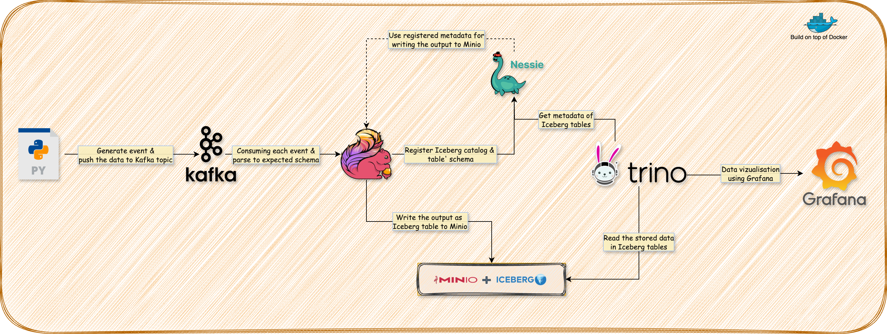

# Open-Source Data Lake Implementation with Kafka, Flink, and Iceberg

This project is part of my **Data Engineering learning journey**, focusing on implementing a **Data Lake using open-source technologies**. It simulates a **ride-hailing use case**, where event data is **ingested, processed, and stored efficiently** in a modern Data Lake architecture.

## 🚀 Project Overview



The pipeline follows these key steps:
1. **Kafka**: Captures and stores incoming ride event data.
2. **Python Producer**: Generates dummy ride events and pushes them to Kafka.
3. **Kafka UI**: Provides a monitoring interface for Kafka topics.
4. **MinIO**: S3-compatible object storage for the Data Lake.
5. **Flink**: Processes event data from Kafka and writes it to **Iceberg tables in MinIO**.
6. **Iceberg**: Provides an optimized table format for storing and managing structured data.
7. **Nessie**: A **Git-like metadata store** for Iceberg, enabling version control for datasets.
8. **Trino**: Allows fast SQL-based querying over the Data Lake.
9. **Grafana**: Visualizes real-time insights from the stored data.

---

## ⚙️ Services and Ports

| Service       | Description                                 | Ports | Full Link |
|--------------|---------------------------------------------|--------|------------|
| **Kafka**        | Message broker for event ingestion        | `9092` (public), `9997` (internal) | N/A |
| **Kafka UI**     | Web UI for Kafka topic monitoring        | `8080` | [http://localhost:8080](http://localhost:8080) |
| **MinIO**        | S3-compatible object storage             | `9000` (API), `9090` (Console) | [http://localhost:9090](http://localhost:9090) |
| **Nessie**       | Metadata store for Iceberg               | `19120` | [http://localhost:19120](http://localhost:19120) |
| **Trino**        | Query engine for Iceberg data            | `8082` (mapped to `8080`) | [http://localhost:8082](http://localhost:8082) |
| **Flink JobManager** | Manages Flink jobs                   | `8081` | [http://localhost:8081](http://localhost:8081) |
| **Grafana**      | Visualization and dashboarding           | `3000` | [http://localhost:3000](http://localhost:3000) |

---

## 🛠 Getting Started

This project includes a **Makefile** to simplify managing services with **Docker Compose**.

### Makefile Commands

#### `make up`
- Starts all services using **Docker Compose**.
- Creates a `.data/minio` directory to persist **MinIO storage**.
- Ensures the MinIO directory has proper permissions.
- Runs `docker-compose up -d` to launch services in the background.

#### `make down`
- Stops and removes all running services.
- Executes `docker-compose down -v` to remove **containers, networks, and volumes**.
- Deletes the `.data` directory to clean up persisted data.

#### `make cleanup`
- Checks if any **Docker Compose** services are running.
- If running, first stops them using the `down` command.
- Removes **all Docker Compose-related images** using:
  ```bash
  docker-compose down -v --rmi all
